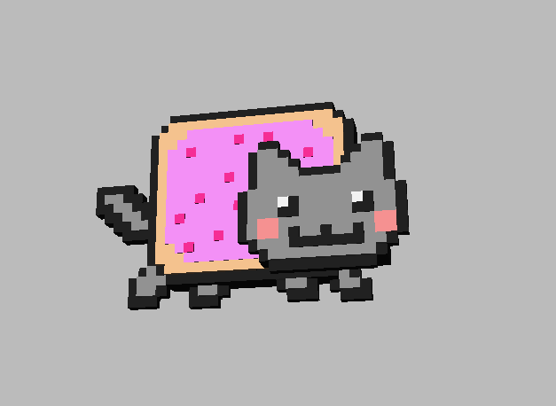
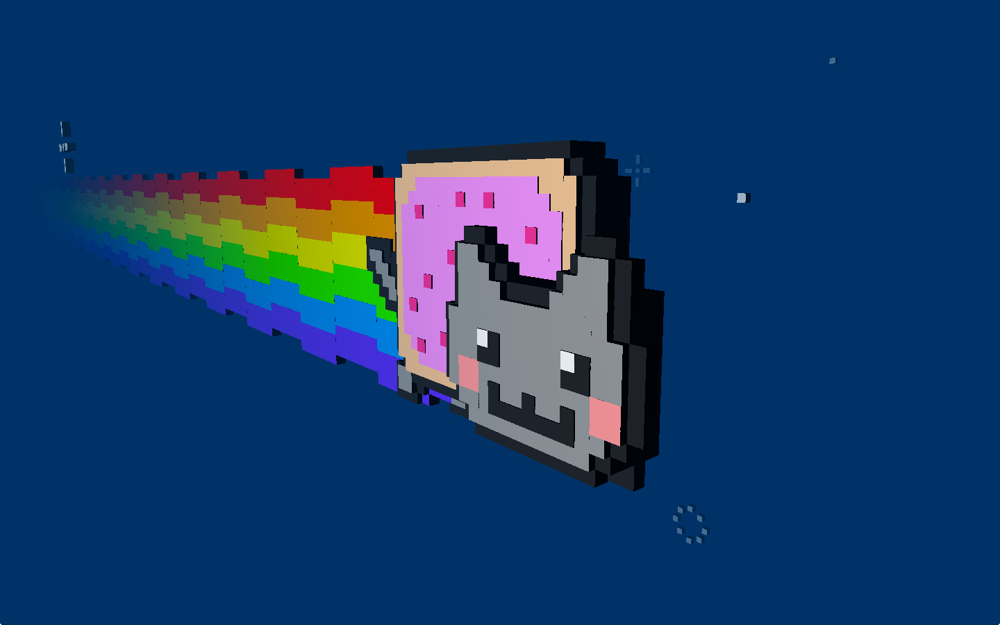

title: Yeoman For Three.js
author:
  name: "Jerome Etienne"
  twitter: "@jerome_etienne"
  url: "http://jetienne.com"
output: index.html

--

<base target='_blank'/>
<style>pre { background: lightgrey; font-size: 100%;}</style>

# Zero to nyancat in 30 seconds flat
## or Yeoman For Three.js

--

## Our Goal [link](demo/index.html)



--

# First The Tools

--

### What Is Three.js

* javascript 3d library - [github](http://threejs.org/)
* effort lead by [mrdoob](http://www.mrdoob.com/)
* large community


--

### What Is Yeoman ?

* Effort from google - [homepage](http://yeoman.io/)
* "Modern Workflow for WebApps"
* Composed of 3 tools: [bower](http://yeoman.io/packagemanager.html)
/ [grunt](http://gruntjs.com/)
/ [yo](https://github.com/yeoman/yo)
  
--

### Why Using Yeoman ?

* **TOTALLY Optional** :)
* You can do the same without yeoman
* Much Faster with it tho!

--

## go deeper about yeoman

--

### grunt for automating tasks

* all done in javascript
* kindof Makefile on steroid

--

### Bower For Packaging

* effort from twitter
* package management: publish/search/install
* similar to npm for node.js

#### Our Usage

* easy to install three.js extensions

--

### Yo For Scafolding

* like you got in rails

#### Our Usage

* for three.js boilerplate
* to start fast your three.js project
* to start with the good practices you like

--

### Installing yeoman

```
sudo npm install -g yo
```

### Installing three.js Generator

usefull to install three.js boilerplate

```
sudo npm install -g generator-threejs-boilerplate
```

--

# Now The Action!

--

### Project Directory

#### create it

```
mkdir yourthreejsproject
```

#### go in

```
cd yourthreejsproject
```

--

### Generate Three.js Boilerplate

```
yo threejs-boilerplate
```


--

### Try Three.js Boilerplate

```make server``` then goto [http://127.0.0.1:8000/](http://127.0.0.1:8000/)


--

## Cool But Rather empty...

--

# Let's Add NyanCat!

--

### threex.nyancat

* threex extensions for basic nyancat
* on github: [repo](https://github.com/jeromeetienne/threex.nyancat/) / 
[demo](http://jeromeetienne.github.io/threex.nyancat/examples/basic.html)



--

## Wait! threex ?

--

# What is threex ?

--

### A Bit On Threex

* ultra light extension system for [three.js](http://mrdoob.github.io/three.js/)
* [threex](http://jeromeetienne.github.io/threex/) on github - 28 modules and counting

</iframe>

--

### threex and yeoman
* [bower](http://bower.io/) for package management
* Support [require.js](requirejs.org) and [yeoman generator](http://yeoman.io) too
  * more on that later

### All Optional
* only there for convenience
* free to use something else if you wish

--

## Back To NyanCat...

--

### Install It With Bower

```bower install threex.nyancat```


Now it is in ```bower_components/threex.nyancat/```

Rather Easy...

--

### Now Let's add Nyan Cat

**Step 1** Include the script

    <script src='bower_components/threex.nyancat/threex.nyancat.js'>
    </script>

**Step 2** Add some javascript

    var nyanCat	= new THREEx.NyanCat()
    nyanCat.container.scale.multiplyScalar(1/30)
    scene.add( nyanCat.container )

**Step 3** And now, the model is in the scene.

--

## Well Almost.. Just The Tail :)


--

# One Last Step

--

## Lets remove the cube...

--

## TADA!! 


--

## Enougth now...

--

# Packing It Up

--

### Generate Three.js Boilerplate 

```
yo threejs-boilerplate
```

### Install threex extension for three.js

```
bower install threex.nyancat
```

Simple Enougth :)

--

### Usefull Links

* yeoman - [http://yeoman.io](http://yeoman.io)
* three.js - [http://threejs.org](http://threejs.org)
* threex - [http://jeromeetienne.github.io/threex/](http://jeromeetienne.github.io/threex/)
