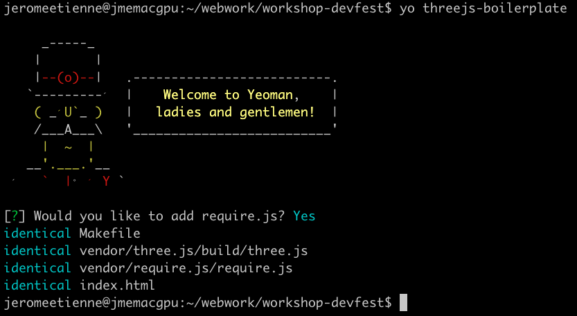
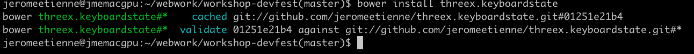

title: WebGL Workshop 
author:
  name: "Jerome Etienne"
  twitter: "@jerome_etienne"
  url: "http://jetienne.com"
output: index.html

--

# Flying Spaceships 
## A Mini Game in THREE.js
  
--

### Meta
* present more the workshop
* what we gonna do
* how we gonna do it
* 1h15... it gonna be fast 
* but we can manage :)
* link all iframe to a viewsource
* dont worry all in on github
  * you can redo it at home
  * [github repo](https://github.com/jeromeetienne/workshop-devfest)

--

### Expected Final Result

<iframe src='http://127.0.0.1:8000/index99.html' width='100%' height='400px'></iframe>

--

### What Is Yeoman ?

* Modern Workflow for WebApps
* [homepage](http://yeoman.io/)

### Using Yeoman ?

* Optional
* Much Faster with it tho
* Time is limited!
* **YES**

--

### Installing yeoman

```
sudo npm install -g yo
```

### Installing three.js Generator

usefull to install three.js boilerplate

```
sudo npm install -g generator-threejs-boilerplate
```

--

### Project Directory

#### create it

```
mkdir workshop-devfest
```

#### go in

```
cd workshop-devfest
```

--

### Generate Three.js Boilerplate

```
yo threejs-boilerplate
```



--

### Try Three.js Boilerplate

```make server``` then goto [http://127.0.0.1:8000/](http://127.0.0.1:8000/)

<iframe src='http://127.0.0.1:8000/index10-postboilerplate.html' width='100%' height='400px'></iframe>

--

## Cool But Rather empty...

# Let's Add SpaceShips!

--

### threex spaceships

* threex extensions for basic spaceships
* on github: [repo](https://github.com/jeromeetienne/threex.spaceships/) / 
[demo](http://jeromeetienne.github.io/threex.spaceships/examples/basic.html)

<iframe src='http://jeromeetienne.github.io/threex.spaceships/examples/basic.html' width='100%' height='480px'></iframe>

--

# Wait!
## What is threex ?

--

### What is threex ?

* ultra light extension system for [three.js](http://mrdoob.github.io/three.js/)
* [threex](http://jeromeetienne.github.io/threex/) on github

<iframe src='http://jeromeetienne.github.io/threex/' width='100%' height='400px'></iframe>

--

### threex Support modern workflows
* [bower](http://bower.io/) for package management
* [require.js](requirejs.org) for dependancies
* [yeoman](http://yeoman.io) for scaffolding

### All Optional
* as in **NOT REQUIRED** :)
* free to use something else if you wish
* only there for convenience

--

## Back To SpaceShips...

--

### threex spaceships with bower

```bower install threex.spaceships```


Now it is in ```bower_components/threex.spaceships/```

Rather Easy...

--

### threex modules with require.js

* Most threex extension support require.js
* Convention: ```package.require.js``` at project root
* require this file to load the module

### Required ?

* Optional
* All free to pick another tech if you wish
* Faster to dev tho

--

### threex spaceships with require.js

Find require.js call in the header and put that

    require([ 'bower_components/threex.spaceships/package.require.js'
            ], function(){
            // ...     
    });
    
Done... not too hard

--

### Now Let's Use SpaceShips

The code to add

    THREEx.SpaceShips.loadSpaceFighter03(function(object3d){
      scene.add(object3d)
    })

And the model is in the scene.

--

## Well almost.. just a wing :)

<iframe src='http://127.0.0.1:8000/index20-spaceship-05-withcube.html' width='100%' height='400px'></iframe>

Lets remove the cube

--

## Better!! 

<iframe src='http://127.0.0.1:8000/index20-spaceship-10-nocube.html' width='100%' height='400px'></iframe>

--

## Grey Background ? Not Too Shabby

# Let's add Stars!

--

## See ?

<iframe src='http://127.0.0.1:8000/index25-stars.html' width='100%' height='400px'></iframe>

--

### How ? with a *environmantal sphere*

* Large Sphere
* we are at it center
* we see the inside of it
* with a proper texture it does the tricks

--

### The Texture

Part of threex.spaceships module

<iframe src='http://127.0.0.1:8000/bower_components/threex.planets/examples/images/galaxy_starfield.png' width='100%' height='400px'></iframe>

--

### The Code

    var geometry  = new THREE.SphereGeometry(90, 32, 32)
    var url   = 'bower_components/threex.planets/examples/images/galaxy_starfield.png'
    var material  = new THREE.MeshBasicMaterial({
      map : THREE.ImageUtils.loadTexture(url),
      side  : THREE.BackSide
    })
    var starSphere  = new THREE.Mesh(geometry, material)
    scene.add(starSphere)

1. a geometry
1. a material
1. then a mesh

--

## So we got a ship in space...

# Where are the Planets ?

--

### Let's add a moon

* available in [threex.planets](https://github.com/jeromeetienne/threex.planets)
* blog post explaining internals [here](http://learningthreejs.com/blog/2013/09/16/how-to-make-the-earth-in-webgl/)
* with bower and require.js again

--

### Earth demo

Earth, cloud, atmosphere, stars, moon, shadow

<iframe src='http://jeromeetienne.github.io/threex.planets/examples/earth.html' width='100%' height='400px'></iframe>

--

### All planets 

based on [planetpixelemporium](http://planetpixelemporium.com/planets.html)

<iframe src='http://jeromeetienne.github.io/threex.planets/examples/select.html#Uranus' width='100%' height='400px'></iframe>

--

### threex planets with bower

```bower install threex.planets```


Now it is in ```bower_components/threex.planets/```

Rather Easy...

--

### threex planets with require.js

Find require.js call in the header and put that

    require([ 'bower_components/threex.planets/package.require.js'
            ], function(){
            // ...     
    });
    
Done... not too hard

--

### The Code

    var moonMesh  = THREEx.Planets.createMoon()
    scene.add(moonMesh) 

--

### The Result

<iframe src='http://127.0.0.1:8000/index30-moon10-nolight.html' width='100%' height='400px'></iframe>

It is there, i promise :)

--

## Why is it black ?

# Let's add some lights

--

### Lights in three.js

* Ambient light
* Directional light
* Hemisphere light
* Point light
* Spot light

--

### Basic 3 points lighting

* typical [lighting](http://en.wikipedia.org/wiki/Three-point_lighting)
* so 1 ambient + 2 directional
* other basic lightings in [threex.basiclighting](https://github.com/jeromeetienne/threex.basiclighting)

--

### The Code

Add a ambient light

    var light = new THREE.AmbientLight( 0x020202 )
    scene.add( light )

Add a light in front

    var light = new THREE.DirectionalLight('white', 1)
    light.position.set(0.5, 0.5, 2)
    scene.add( light )

Add a light behind

    var light = new THREE.DirectionalLight('white', 0.75)
    light.position.set(-0.5, -0.5, -2)
    scene.add( light )


--

### The Result

<iframe src='http://127.0.0.1:8000/index30-moon10-withlight.html' width='100%' height='400px'></iframe>

better, at least we see the moon :)

--

## the spaceship disapeared again tho...

# Move Space Ships Away

--

### Put Spaceships On the Left

the code to add in model loader callback

    spaceship.rotateY(Math.PI/2)
    spaceship.position.x  = -1

<iframe src='http://127.0.0.1:8000/index30-moon15-leftspaceship.html' width='100%' height='400px'></iframe>

--

## Not Bad... Let's move the player now!

# Use keyboard for controls

--

### threex.keyboardstate

* to keep the current state of the keyboard.
* github [repo](https://github.com/jeromeetienne/threex.keyboardstate/)
/ [demo](http://jeromeetienne.github.io/threex.keyboardstate/examples/basic.html)
* blog post explaining internals [here](http://learningthreejs.com/blog/2011/09/12/lets-Make-a-3D-game-keyboard/)
* with bower and require.js again

### Basic Usage
    
    var keyboard  = new THREEx.KeyboardState();
    if( keyboard.pressed("shift+H") ){
        console.log('you are pressing shift and H')
    }

--

### threex keyboardstate with bower

```bower install threex.keyboardstate```



--

### threex keyboardstate with require.js

Find require.js call in the header and put that

    require([ 'bower_components/threex.keyboardstate/package.require.js'
            ], function(){
            // ...     
    });

Done... not too hard

--

### Controls Player With Keyboard

The Algo

* add a function in the rendering loop
* monitor keyboard state
* move spaceship accordingly

Pitfalls

* async in spaceship loading
* speed independant of fps

--

### The Code

    // create keyboard instance
    var keyboard  = new THREEx.KeyboardState();
    
    // add function in rendering loop
    updateFcts.push(function(delta, now){

        // only if the spaceship is loaded
        if( spaceship === null )  return;

        // set the speed
        var speed = 1;
        // only if spaceships is loaded
        if( keyboard.pressed('down') ){
            spaceship.position.y  -= speed * delta;
        }else if( keyboard.pressed('up') ){
            spaceship.position.y  += speed * delta;
        }

    })

--

### The Result

<iframe src='http://127.0.0.1:8000/index35-controls10-nolimit.html' width='100%' height='400px'></iframe>

## oops it's going out

--

### Limit SpaceShip Range

Add that in the function

    if( spaceship.position.y < -1 ){
      spaceship.position.y  = -1  
    }
    if( spaceship.position.y > +1 ){
      spaceship.position.y  = +1  
    }

Thus player is stopped when it goes too high, or too low

--

### The Result

<iframe src='http://127.0.0.1:8000/index35-controls15-withlimit.html' width='100%' height='400px'></iframe>


